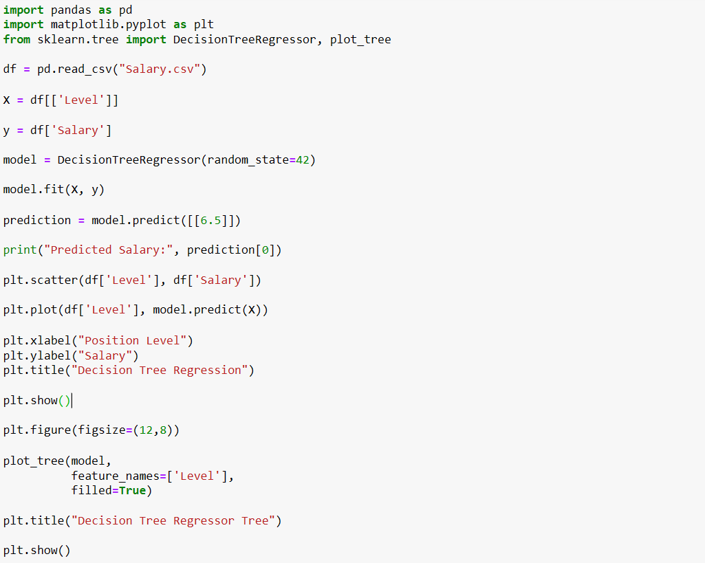
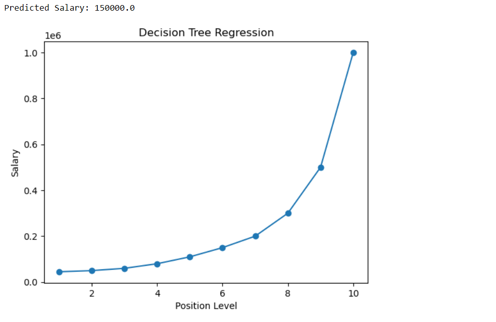
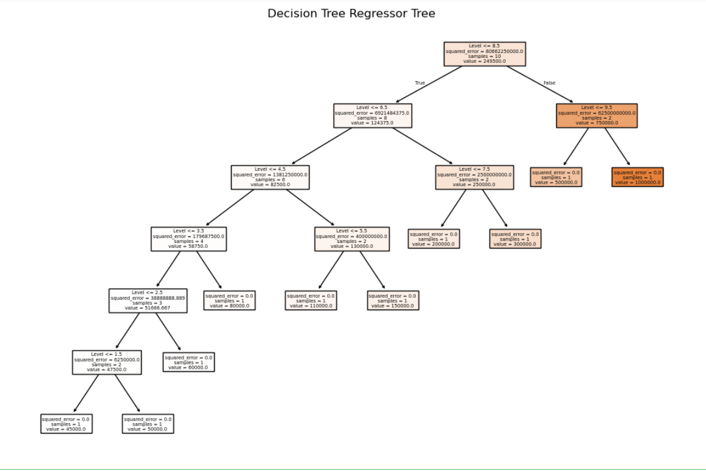

# Implementation-of-Decision-Tree-Regressor-Model-for-Predicting-the-Salary-of-the-Employee

## AIM:
To write a program to implement the Decision Tree Regressor Model for Predicting the Salary of the Employee.

## Equipments Required:
1. Hardware – PCs
2. Anaconda – Python 3.7 Installation / Jupyter notebook

## Algorithm

1. Import the libraries and read the data frame using pandas.
2. Calculate the null values present in the dataset and apply label encoder.
3. Determine test and training data set and apply decison tree regression in dataset.
4. calculate Mean square error,data prediction and r2.

## Program:
```
/*
Program to implement the Decision Tree Regressor Model for Predicting the Salary of the Employee.

#Ex 09 - Implementation of Decision Tree Regressor Model for Predicting the Salary of the Employee

# Import libraries
import pandas as pd
import matplotlib.pyplot as plt
from sklearn.tree import DecisionTreeRegressor, plot_tree

df = pd.read_csv("Salary.csv")

X = df[['Level']]

y = df['Salary']

model = DecisionTreeRegressor(random_state=42)

model.fit(X, y)

prediction = model.predict([[6.5]])

print("Predicted Salary:", prediction[0])

plt.scatter(df['Level'], df['Salary'])

plt.plot(df['Level'], model.predict(X))

plt.xlabel("Position Level")
plt.ylabel("Salary")
plt.title("Decision Tree Regression")

plt.show()

plt.figure(figsize=(12,8))

plot_tree(model,
          feature_names=['Level'],
          filled=True)

plt.title("Decision Tree Regressor Tree")

plt.show()

Developed by: Swathi P N
RegisterNumber:  212225230279
*/
```

## Output:







## Result:
Thus the program to implement the Decision Tree Regressor Model for Predicting the Salary of the Employee is written and verified using python programming.
